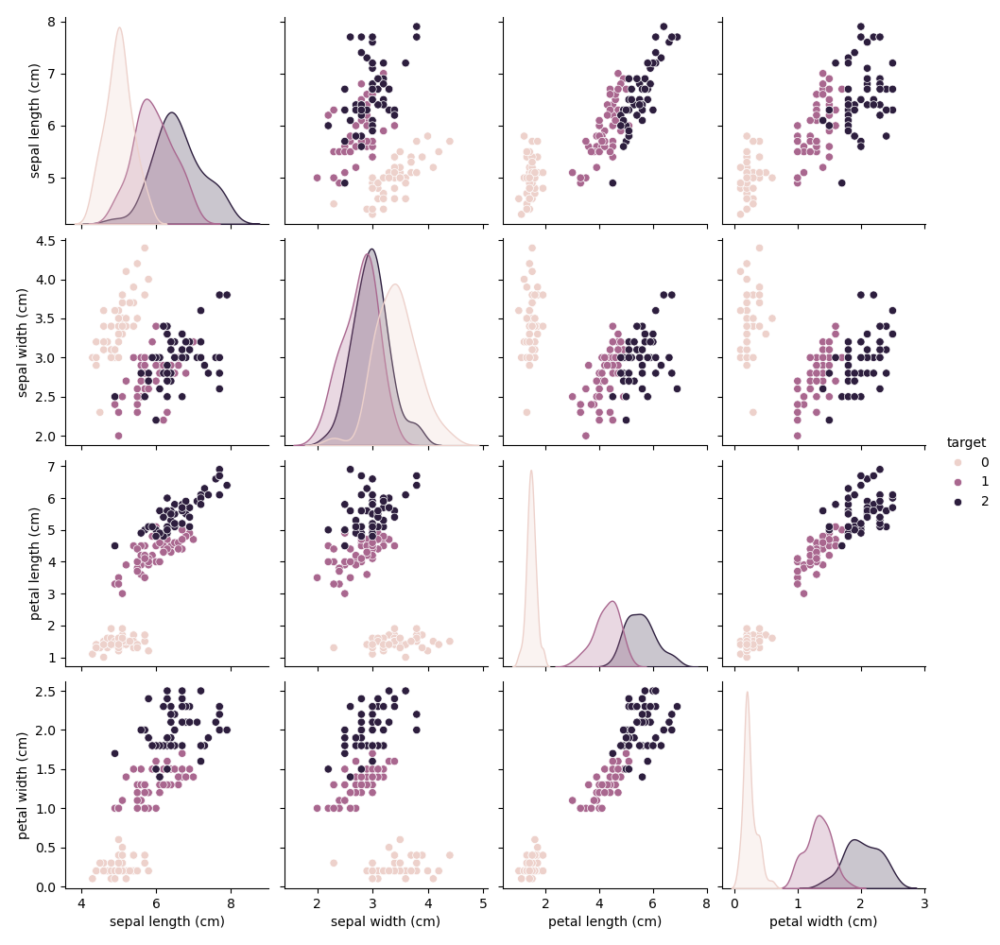
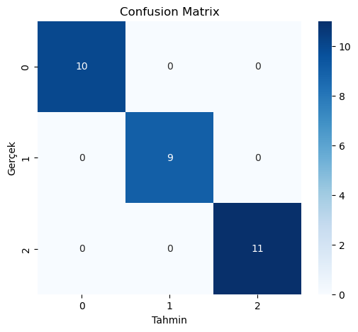
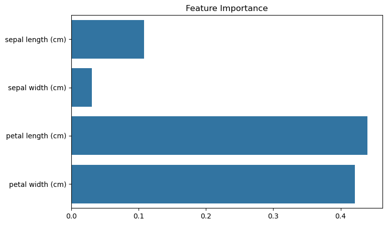
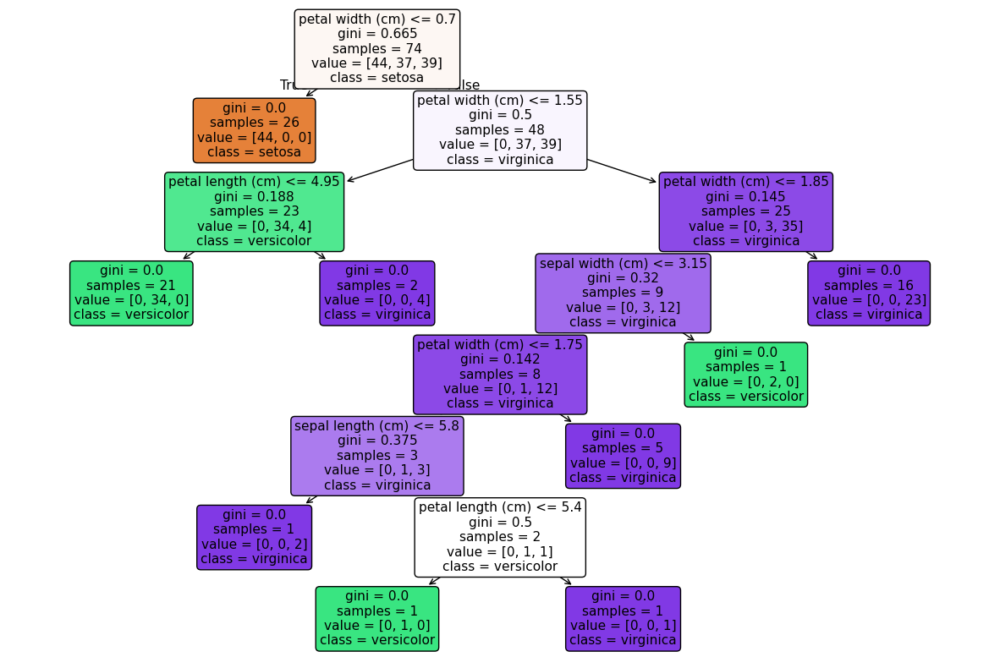

  

<h1 align="center"> Iris Flower Classification </h1>

🌸 Bu proje, **Iris veri seti** kullanılarak çiçek türü tahmini yapan temel bir  
**Makine Öğrenmesi (Machine Learning)** sınıflandırma uygulamasıdır.  
Model olarak **Random Forest Classifier** kullanılmıştır.

---

## 🎯 Proje Amacı

- Denetimli öğrenme (Supervised Learning) sürecini uygulamak  
- Veri görselleştirme ile sınıflar arası farkları analiz etmek  
- Bir makine öğrenmesi modelini eğitmek, değerlendirmek ve yorumlamak  

---

## 📊 Veri Seti

- Kaynak: `sklearn.datasets.load_iris`
- Örnek sayısı: 150
- Sınıf sayısı: 3 (Setosa, Versicolor, Virginica)
- Özellikler:
  - Sepal Length
  - Sepal Width
  - Petal Length
  - Petal Width

---

## 🛠 Kullanılan Teknolojiler

- Python
- scikit-learn
- pandas
- matplotlib
- seaborn

---

## 🔍 Proje Akışı

- Veri seti yüklendi ve DataFrame’e dönüştürüldü  
- Pairplot ile keşifsel veri analizi (EDA) yapıldı  
- Veri %80 eğitim, %20 test olarak ayrıldı  
- Random Forest modeli eğitildi  
- Accuracy ve Confusion Matrix ile performans ölçüldü  
- Yeni bir çiçek için tahmin yapıldı  
- Feature Importance analizi gerçekleştirildi  
- Model içindeki bir karar ağacı görselleştirildi  

---

## 📊 Model Çıktıları

### Pairplot (Keşifsel Veri Analizi)

Pairplot grafiği, çiçek türlerinin özellikle **petal ölçümleri** üzerinden
birbirinden net şekilde ayrıldığını göstermektedir.
Bu görselleştirme, model eğitimi öncesinde hangi özelliklerin daha ayırt edici
olduğunu anlamaya yardımcı olmuştur.

---

### Confusion Matrix

Confusion Matrix incelendiğinde, modelin sınıfların büyük çoğunluğunu
doğru tahmin ettiği görülmektedir.
Yanlış sınıflandırmaların ağırlıklı olarak **Versicolor** ve **Virginica**
sınıfları arasında gerçekleştiği gözlemlenmiştir.

---

### Feature Importance

Feature importance analizi, modelin karar verirken en çok
**Petal Length** ve **Petal Width** özelliklerine ağırlık verdiğini göstermektedir.
Bu durum, veri seti üzerindeki tür ayrımının büyük ölçüde
taç yaprak ölçümleri üzerinden gerçekleştiğini doğrulamaktadır.

---

### 🌳 Decision Tree (Örnek)

- Random Forest modeli, birden fazla karar ağacının birlikte çalışması sayesinde
tek bir karar ağacına kıyasla **daha kararlı ve genellenebilir** sonuçlar üretmektedir.

- Bu görselleştirilen ağaç, Random Forest modeli içerisindeki **tek bir karar ağacını**
temsil etmektedir. Amaç, modelin genel yapısını değil,
**tekil bir ağacın nasıl karar verdiğini** anlamaktır.

---

## 📈 Model Performansı ve Yorum

Model, Iris veri seti üzerinde **yüksek doğruluk (%95+)** ile çalışmıştır.  
Confusion Matrix sonuçları, sınıfların büyük bir kısmının doğru tahmin edildiğini
göstermektedir.

Random Forest algoritmasının, birden fazla karar ağacının ortak kararıyla
çalışması sayesinde **overfitting riski azalmış** ve
daha dengeli bir performans elde edilmiştir.

---

## 🧠 Ne Öğrendim ?

- Uçtan uca bir makine öğrenmesi sürecinin nasıl kurulduğunu  
- Keşifsel veri analizi (EDA) için görselleştirmenin önemini  
- Random Forest algoritması ile sınıflandırma yapmayı  
- Confusion Matrix ve accuracy metrikleri ile model değerlendirmeyi  
- Feature importance analizi ile model kararlarını yorumlamayı  
- Yeni ve daha önce görülmemiş veriler üzerinde tahmin yapmayı  

---
## 👩‍💻 Geliştirici

**Esra Kumas**  
Machine Learning & Software Development Enthusiast

---

⭐ **Bu projeyi faydalı bulduysanız**  
GitHub üzerinden **star** vermeyi unutmayın! ⭐

 
<a href="#-iris-flower-classification-machine-learning">
⬆️ <strong>Başa Dön</strong>
</a>

